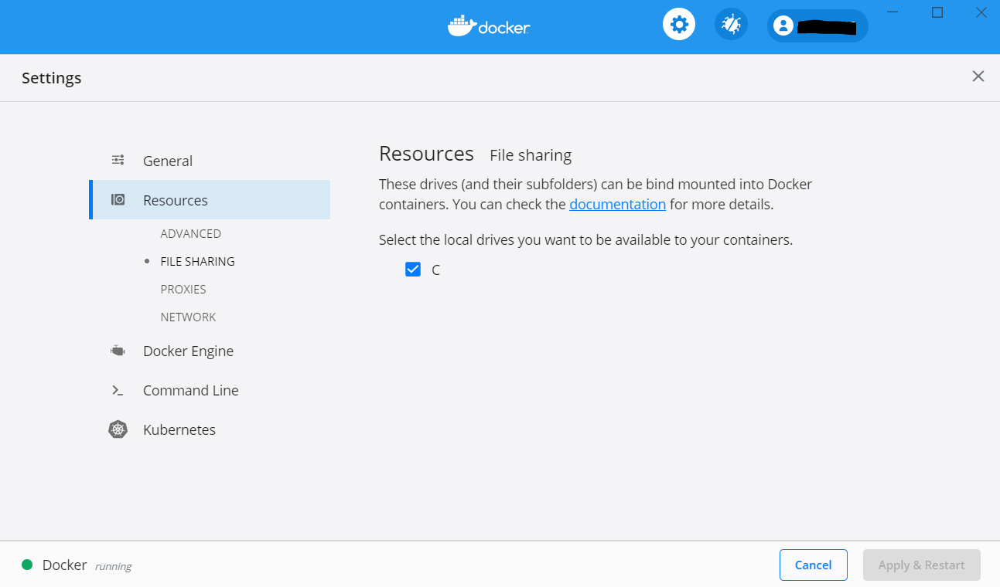

# Ski Simulation tool
## What is the ski simulation tool
The goal of the ski simulation tool is to code in a fun way.  
The programmer will develop an algorithm to control a skier that has to reach the foot of a mountain.  
Once the user has written and uploaded his algorithm, the engine will calculate the skier's route.   
If the skier collides or falls off the track on his route, the engine will only return the route up to that point.  
In this way, the user can optimize the algorithm and make the route more efficient. 

## How it will look like! 

## Requirements
* [Docker](https://www.docker.com)
* Right version of the driver the language the algorithm will be written in.
* IDE of you choise

## How can I use the ski simulation
Clone this repository and you can start!

### Uncomment the parts u need for you langue
In this repository, you will find templates for multiple programming languages.  
Choose the language you prefer the most.  
In the **docker-compose.yml** file you have to  **uncomment** the configuration for your chosen language.

### Write your algorithm
When you have decided which language you will use, you can start programming!  
Go to the **folder of the language** you choose and open de algorithm file.  
In this template you'll see the skier will always go down.  
Each time the algorithm returns a action, de engine will calculate the new viewport. Then de algorithm will run again.    
This process will take place as long as the skier doesn't end the track or collies.   
So the action you return in de algorithm can be based on the actual viewport.

#### Viewport
Before the algorithm sends a action to the server, the algorithm receives a viewport.  
The viewport is a **matrix of points** which represent the vision of de skier.   
Based on what de algorithm receives it can make a **decision** of what will be the **next action**.   
*An example of the viewport you can find in the README of your chosen language.*

### Execute your algorithm
When you finished writing the best algorithm ever you'll need to execute it.  
Go in the terminal to the main where you can find the **docker-compose.yml** file. Here you can execute you algorithm by typing **docker-compose up**.  
This command will spin up your algorithm with the engine. When they are ready the route of de skier will be written in the **results.json** file in de folder **web/results**.

#### Access to C: drive
It is very important that your local docker has access to you C: drive.  
You can check this in your Docker *settings -> Resources -> File sharing*.  
Here you can give Docker access to your C: drive to write back the results.json.

### Visualisation
For the visualization of your run, you'll have to go to the web folder.  
Here you can go to the terminal and execute **"docker-compose up"**.    
If it is ready you can see your run in your **localhost/8080**

### GOOD LUCK!